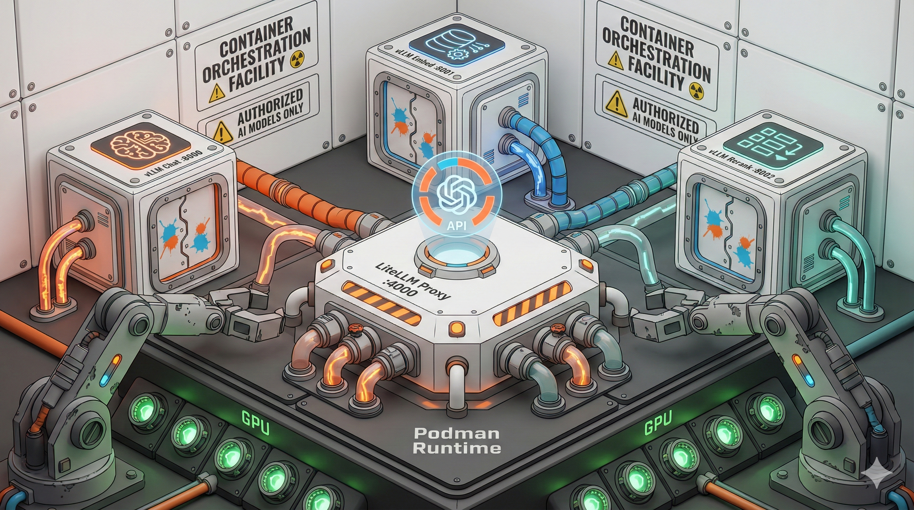

# GnarlyvLLM 🤙



GnarlyvLLM is a powerful container orchestration tool for vLLM and Gnarly Proxy, designed to simplify the management of multiple Large Language Models (LLMs) on a single machine using Podman.

It allows you to define models and "stacks" (groups of models) in a simple TOML configuration, automatically managing the lifecycle of vLLM containers and providing a unified OpenAI-compatible API through a custom Bun-based proxy.

## Features

- 🏗️ **Container Orchestration**: Seamlessly manage vLLM instances for generation, embedding, and scoring tasks using Podman.
- 🔄 **Unified API**: Integrated Gnarly Proxy provides a single, OpenAI-compatible endpoint for all your models.
- 📚 **Stack Management**: Group models into "stacks" with specific resource overrides (GPU memory, context length) for different use cases.
- 📊 **Interactive Dashboard**: Built-in TUI (Text User Interface) built with [openTUI](https://github.com/opentui/opentui) for real-time monitoring of model status and logs.
- ⚙️ **TOML Configuration**: Easy-to-read configuration for models, ports, and hardware resource allocation.
- 🏎️ **Optimized for Bun**: Built with Bun for high performance and a modern development experience.

## Getting Started

### Prerequisites

- [Bun](https://bun.sh/) runtime
- [Podman](https://podman.io/) (for container orchestration)
- NVIDIA GPU with appropriate drivers (for vLLM)

### Installation

```bash
git clone <repository-url>
cd projects/gnarlyvllm
bun install
```

### Configuration

Create a `gnarlyvllm.toml` file in the project root. You can start with the example:

```bash
cp gnarlyvllm.example.toml gnarlyvllm.toml
```

Edit `gnarlyvllm.toml` to define your models and stacks:

```toml
[settings]
litellm_port = 4000
huggingface_cache = "~/.cache/huggingface"

[models.chat-qwen-7b]
repo = "Qwen/Qwen2.5-7B-Instruct-AWQ"
task = "generate"
port = 8000

[stacks.rag-qwen-7b]
description = "RAG stack for video transcriptions"
models = ["chat-qwen-7b", "embed-bge-m3"]
```

## Usage

GnarlyvLLM provides a straightforward CLI for managing your models:

```bash
# Start a single model and the Gnarly Proxy
bun gnarlyvllm serve chat-qwen-7b

# Start a predefined stack of models
bun gnarlyvllm start rag-qwen-7b

# Check the status of running containers
bun gnarlyvllm status

# Open the interactive dashboard
bun gnarlyvllm dashboard

# Stop all running GnarlyvLLM containers
bun gnarlyvllm stop
```

## CLI Commands

- `serve <model>`: Start a single model + Gnarly Proxy.
- `start <stack>`: Start all models in a stack + Gnarly Proxy.
- `stop [name]`: Stop a specific model/stack or all running containers.
- `status`: Show running models and resource usage.
- `dashboard`: Open the interactive TUI dashboard.
- `list`: List available models and stacks defined in your config.
- `logs <model>`: Tail logs for a specific model container.
- `config check`: Validate your `gnarlyvllm.toml`.
- `config init`: Create an example configuration file.

## Development

To run the CLI in development mode:

```bash
bun dev start <stack>
```

The project is structured as a monorepo:

- `packages/core`: Shared business logic for configuration, Podman interaction, and orchestration.
- `packages/cli`: TUI (built with openTUI / React) and CLI entry point.

## License

MIT
