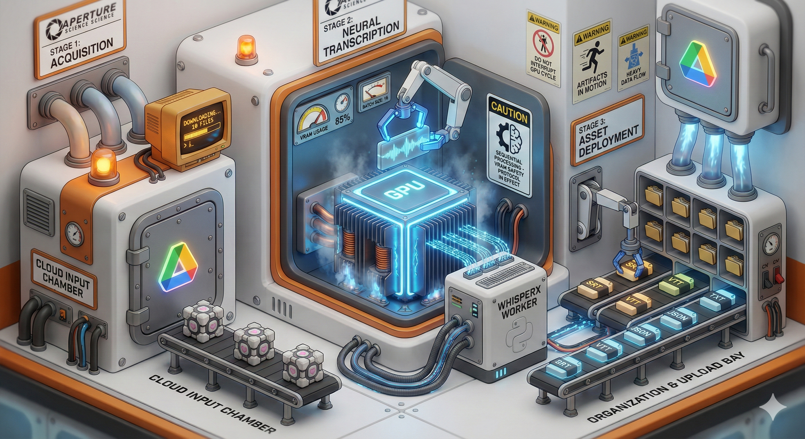

# Whisper Transcriber (`whisper-project`) 🎙️ 📄



`whisper-project` is a high-performance transcription pipeline designed for the Hopkins family video archive. It automates the process of downloading videos from Google Drive, extracting audio, and generating precise, time-aligned transcripts using WhisperX.

## Features

- ☁️ **Google Drive Integration**: Authenticate and download video files directly from designated Drive folders.
- ⚡ **High-Speed Transcription**: Utilizes **WhisperX** (large-v3) with batch processing for transcription speeds significantly faster than real-time.
- 📏 **Forced Alignment**: Uses phoneme-level alignment to ensure timestamps are perfectly synced with the audio.
- 🔄 **Polyglot Architecture**: Orchestrated with **Bun (TypeScript)** for high-level logic and **Python** for GPU-intensive ML tasks, connected via a robust subprocess bridge.
- 📂 **Multiple Export Formats**: Automatically generates `.json`, `.srt`, `.vtt`, and `.txt` files for every video.
- 🛠️ **Ffmpeg Integration**: Efficient audio extraction and preprocessing before transcription.

## System Architecture

The project employs a bridge pattern to combine the strengths of two environments:

1.  **TypeScript (Bun) Controller**:
    - Manages file system operations and Google Drive API.
    - Handles audio extraction via FFmpeg.
    - Orchestrates the persistent Python worker.
    - Post-processes raw JSON into subtitle formats.
2.  **Python (WhisperX) Worker**:
    - Persistent process that keeps the ML models loaded in VRAM for zero-latency startup between files.
    - Performs the heavy lifting of speech-to-text and alignment using CUDA.

## Prerequisites

- [Bun](https://bun.sh/) runtime
- [Python 3.12+](https://www.python.org/) (managed via `uv` recommended)
- [FFmpeg](https://ffmpeg.org/)
- NVIDIA GPU with CUDA support
- Google Cloud Console Project (for Drive API access)

## Setup

### 1. Install Dependencies

```bash
# Install Bun dependencies
bun install

# Install Python dependencies (WhisperX, Torch, etc.)
# It is recommended to use 'uv' to manage the virtual environment
uv sync
```

### 2. Authentication

You need a `credentials.json` from your Google Cloud Console. Then run:

```bash
bun run auth
```

Follow the URL to authorize the application. This will save a `token.json` for subsequent use.

### 3. Configuration

Review `src/config.ts` or set appropriate environment variables for your Google Drive folder IDs and local paths.

## Usage

### Complete Workflow

```bash
# 1. Download videos from Google Drive
bun run download

# 2. Run the transcription pipeline
bun run transcribe

# 3. (Optional) Process a single file
bun run transcribe --file "vacation_2023.mp4"

# 4. Generate metadata mapping
bun run map
```

## CLI Commands

- `bun run auth`: Initialize Google OAuth2 flow.
- `bun run download`: Sync videos from Google Drive to local storage.
- `bun run transcribe`: Process all local videos through WhisperX.
- `bun run map`: Create a mapping between local filenames and Google Drive file IDs.
- `bun run organize`: Clean up and organize transcription artifacts.

## License

MIT
